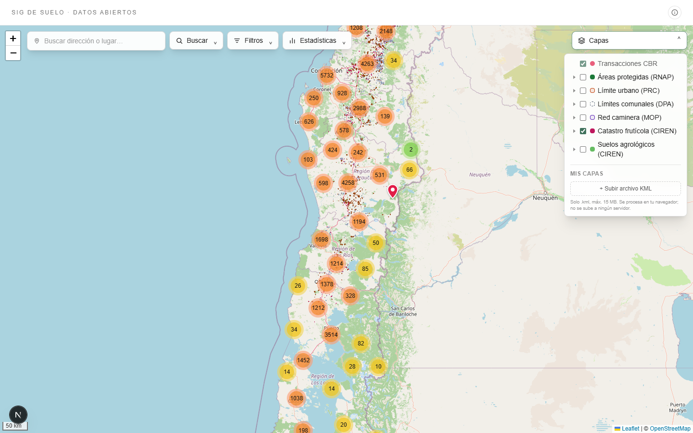

# sig.gabrielpantoja.cl — SIG de suelo

Mapa interactivo de **datos abiertos** de transacciones de suelo rural inscritas
en el Conservador de Bienes Raíces (CBR) del centro-sur de Chile, con capas
temáticas oficiales (áreas protegidas, límite urbano, límites comunales, red
caminera, catastro frutícola, suelos agrológicos). Pensado como instrumento de
investigación en ecoinformática y, de paso, como herramienta de consulta para
peritos en tasaciones judiciales y expropiaciones.



(Vista inicial con panel "Capas" desplegado; ver
[./docs/screenshot-sig-suelo-home.png](./docs/screenshot-sig-suelo-home.png) para
la versión sin el panel.)

## Stack

- **Next.js 16** (App Router) + **React 19** + **TypeScript**
- **Tailwind CSS v4**
- **Leaflet** + **leaflet.markercluster** (clustering imperativo de ~74k puntos)
- **Neon** (`@neondatabase/serverless`) — única fuente de verdad para las
  transacciones CBR, rol `web_readonly` (SELECT unicamente)
- **Deploy**: Vercel · dominio `sig.gabrielpantoja.cl`

## Arquitectura

El navegador no habla con Postgres; todo pasa por route handlers serverless que
consultan Neon con una whitelist de columnas (nunca PII):

```
Browser → /api/{points,stats,export,facets} → Neon (web_readonly, SELECT)
Browser → /api/geocode → Nominatim/OSM (address search, Chile only, cached proxy)
```

| Endpoint | Qué hace |
|---|---|
| `GET /api/points` | Puntos geolocalizados filtrados (slice privacy-safe) |
| `GET /api/stats` | count, avg, mediana, min/max, $/m² sobre el set filtrado |
| `GET /api/export?format=csv\|geojson` | Descarga del set filtrado (CSV con BOM+`;`, o GeoJSON para QGIS) |
| `GET /api/facets` | Comunas + rangos de año/monto para poblar los filtros |

**Filtros compartidos** (`src/lib/filters.ts`, parametrizados $N, anti-inyección):
`comuna`, `anio_min/max`, `monto_min/max`, `sup_min/max`, `predio` (ILIKE),
`rol` (ILIKE).

## Datos & privacidad

Columnas expuestas por punto: `lat, lng, monto, anio, comuna, predio,
superficie, rol, destino, fojas, numero, conservador`.

- **`rol` SII se expone**: es el identificador público de propiedad del SII, no
  es dato personal bajo la Ley 19.628. Habilita la búsqueda por ROL para
  peritos.
- **NUNCA se exponen**: `comprador, vendedor, rut, user_id, observaciones`.
  Estas columnas son PII y se descartan en el handler (`src/app/api/points/route.ts:34-49`)
  y en `src/lib/security.ts` (origin allowlist + rate-limit).

## Fuentes de datos y licencias

| Capa | Fuente | Licencia | Construcción |
|---|---|---|---|
| Transacciones CBR | Recopilación propia de inscripciones del CBR | Datos abiertos (anonimizado bajo Ley 19.628) | Neon (`verceldb`), rol read-only |
| Áreas protegidas (RNAP) | [Ministerio del Medio Ambiente — Registro Nacional de Áreas Protegidas](https://lineasdebasepublicas.mma.gob.cl/datos_abiertos/dataset/areas-protegidas), portal *Líneas de Base Públicas* | **CC0 1.0** (dominio público) | `npm run data:build:protected` (ETL con mapshaper) |
| Límite urbano (PRC) | MINVU — planes reguladores comunales | Verificar con MINVU (uso referencial) | `npm run data:build:urban` |
| Límites comunales (DPA) | SUBDERE — División Político-Administrativa 2023 (geoportal.cl) | Datos abiertos del Estado de Chile | `npm run data:build:comunas` |
| Red caminera | MOP — Dirección de Vialidad (mapasvialidad.mop.gob.cl) | Verificar con MOP (uso referencial) | `npm run data:build:red-vial` |
| Catastro Frutícola | CIREN-ODEPA, vía IDE Minagri | Atribución CIREN-ODEPA (ver `src/lib/catastro-fruticola.ts`) | `npm run data:build:catastro-fruticola` |
| Suelos agrológicos | CIREN, ArcGIS público (esri.ciren.cl) | Atribución CIREN (ver `src/lib/suelos.ts`) | Dinámica remota (PNG por viewport) |

> Cada capa tiene un archivo `*.meta.json` adyacente que documenta la fecha de
> corte (`vintage`), el organismo proveedor y la URL de la ficha SIMBIO o
> equivalente. Ver `src/lib/*.ts` para la attribution string exacta usada en
> panel, popup y leyenda.

> Nota científica: las áreas protegidas tienen 12 designaciones legales
> distintas (Parque Nacional, Reserva Nacional, Monumento Natural, Santuario de
> la Naturaleza, etc.), cada una bajo jurisdicción y normativa propia. No
> deben tratarse como una sola categoría.

## Desarrollo

```bash
cp .env.example .env.local   # completar NEON_DATABASE_URL (rol web_readonly)
npm install
npm run dev                  # http://localhost:3000
npm run build
```

## Variables de entorno

- `NEON_DATABASE_URL` — cadena read-only de Neon (server-side only, sin prefijo
  `NEXT_PUBLIC_`). Configurar en `.env.local` y en Vercel.

## Configuración de agentes AI

Este repo es leído por Claude Code, OpenCode y Codex. El archivo canónico de
instrucciones para agentes es **[AGENTS.md](./AGENTS.md)**. La configuración
por-máquina (modelo, providers, permisos) vive en **[AGENTS.local.md]**
(gitignored). El `opencode.json` en la raíz es solo un seed neutro mínimo —
cada operador debe crear su propio `opencode.local.json` si quiere override.

## Datos en el repo vs. bucket externo

Los GeoJSON pre-construidos viven **commiteados a `public/data/`** (~45 MB en
total, bajo el umbral de aviso de GitHub). Cada uno se regenera con
`npm run data:build:<capa>` desde fuentes oficiales.

> Migración planeada (Q4-2026): mover el output del ETL a un bucket externo
> (R2 / S3 / Vercel Blob) para permitir capas más grandes (PMTiles / Vector
> Tiles) sin inflar el repo. Detalle y ADR en `docs/roadmap.md` y en el
> mirror privado.

## Roadmap

Las capas pendientes y mejoras UX están priorizadas en
`docs/roadmap.md`, con criterios de valor / accesibilidad de dato / costo de
implementación.

## Licencia

- **Código**: [MIT](./LICENSE) © 2026 Gabriel Pantoja.
- **Datos de áreas protegidas**: CC0 1.0 (Ministerio del Medio Ambiente de
  Chile).
- **Mapa base**: © OpenStreetMap contributors.
- **Demás capas**: ver tabla "Fuentes de datos y licencias" arriba; cada
  `meta.json` declara la atribución exacta que debe mostrarse al usuario.