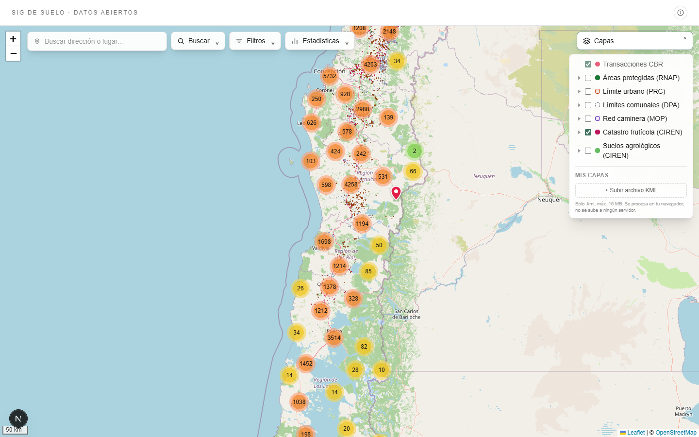

# sig.gabrielpantoja.cl — Land GIS

An interactive **open-data** map of rural land transactions recorded by Chilean
Real Estate Registries (*Conservadores de Bienes Raíces*, CBR) across
south-central Chile. It combines transaction records with official thematic
layers such as protected areas, urban boundaries, administrative boundaries,
the national road network, fruit-growing cadastres, and agricultural soils.

The project is designed as an ecoinformatics research tool and as a practical
reference for professionals working on court-ordered appraisals and
expropriations.



(Initial view with the **Layers** panel open. See
[the home screenshot](./docs/screenshot-sig-suelo-home.png) for the same view
with the panel closed.)

## Technology stack

- **Next.js 16** (App Router), **React 19**, and **TypeScript**
- **Tailwind CSS v4**
- **Leaflet** and **leaflet.markercluster** for imperative clustering of
  approximately 74,000 points
- **Neon** (`@neondatabase/serverless`) as the source of truth for CBR
  transactions, accessed through a SELECT-only `web_readonly` role
- **Vercel** deployment at `sig.gabrielpantoja.cl`

## Architecture

The browser never connects directly to PostgreSQL. All database access goes
through server-side route handlers that query an explicit allowlist of
privacy-safe columns:

```text
Browser → /api/{points,stats,export,facets,hexbins} → Neon (web_readonly, SELECT)
Browser → /api/geocode → Nominatim/OSM (Chile-only address search, cached proxy)
Browser → /api/suelos/{export,identify} → CIREN (fixed, validated proxy)
Browser → /api/vegetacional/{export,identify} → CONAF (fixed, validated proxy)
Browser → /api/propiedades-rurales/{export,identify,feature,search} → SII/CIREN (fixed, validated proxy)
```

| Endpoint | Purpose |
|---|---|
| `GET /api/points` | Returns filtered, geolocated transaction points using a privacy-safe data shape |
| `GET /api/stats` | Computes count, average, median, minimum/maximum, and price per square metre over the filtered set |
| `GET /api/export?format=csv\|geojson` | Downloads the filtered set as an Excel-friendly CSV (`BOM` + `;`) or as GeoJSON for QGIS |
| `GET /api/facets` | Returns communes and year/amount ranges used to populate filters |
| `GET /api/suelos/export` | Returns a CIREN soil PNG for the current viewport, with timeout and response-type validation |
| `GET /api/suelos/identify` | Returns a sanitised agricultural soil classification for one point |
| `GET /api/vegetacional/{export,identify}` | Same viewport-PNG plus point-query pattern against the CONAF vegetation service |
| `GET /api/propiedades-rurales/{export,identify,feature,search}` | Rural-property cadastral parcels through a validated proxy |
| `GET /api/hexbins` | PostGIS `ST_HexagonGrid` aggregation of median price per square metre, the sampling lattice behind the value heat map |
| `GET /api/version` | Deployment identity (`version` + `build`) polled by the in-app update notice; the one route exempt from the rate limit |

Shared filters are defined in `src/lib/filters.ts`. They use parameterised SQL
placeholders and include `comuna`, `anio_min/max`, `monto_min/max`,
`sup_min/max`, `predio` (`ILIKE`), and `rol` (`ILIKE`).

## Data and privacy

Public fields returned for each point are `lat`, `lng`, `monto`, `anio`,
`comuna`, `predio`, `superficie`, `rol`, `destino`, `fechaEscritura`, `fojas`,
`numero`, and `conservador`.

- **The SII property identifier (`rol`) is intentionally public.** It is a
  public property identifier issued by Chile's Internal Revenue Service
  (*Servicio de Impuestos Internos*, SII), not personal data under Chilean Law
  No. 19,628. Appraisers commonly use it to locate properties.
- **The API never exposes** `comprador`, `vendedor`, `rut`, `user_id`, or
  `observaciones`. These fields may contain personally identifiable information
  and are excluded at the query/handler level.
- Database credentials remain server-side in `NEON_DATABASE_URL`; no client
  bundle imports or connects to Neon.

## Data sources and licences

| Layer | Source | Licence / terms | Build or runtime path |
|---|---|---|---|
| CBR transactions | Project-maintained compilation of CBR registrations | Open data, anonymised in accordance with Chilean Law No. 19,628 | Neon Postgres through a read-only role |
| Protected areas (RNAP) | [Ministry of the Environment — National Registry of Protected Areas](https://lineasdebasepublicas.mma.gob.cl/datos_abiertos/dataset/areas-protegidas), *Public Baselines* portal | **CC0 1.0** (public domain) | `npm run data:build:protected` (mapshaper ETL) |
| Urban boundaries (PRC) | MINVU — municipal regulatory plans | Confirm terms with MINVU; referential use | `npm run data:build:urban` |
| Municipal boundaries (DPA) | SUBDERE — 2023 Political-Administrative Division (geoportal.cl) | Chilean government open data | `npm run data:build:comunas` |
| National road network | MOP — Directorate of Roads (mapasvialidad.mop.gob.cl) | Confirm terms with MOP; referential use | `npm run data:build:red-vial` |
| Electrical transmission lines | Ministry of Energy — IDE Energía; CEN geometry | Institutional public coverage; no standard licence declared; attribution required | `npm run data:build:lineas-transmision` |
| Drainage network (rivers and streams) | DGA — Banco Nacional de Aguas (ArcGIS FeatureServer) | Chilean government open data; DGA attribution, see `src/lib/red-drenaje.ts` | `npm run data:build:red-drenaje` |
| Fruit-growing cadastre | CIREN-ODEPA through IDE Minagri | CIREN-ODEPA attribution; see `src/lib/catastro-fruticola.ts` | `npm run data:build:catastro-fruticola` |
| Vegetation resources | CONAF through SIT CONAF and IDE Minagri | CONAF attribution; review the official source terms in `src/lib/vegetacional.ts` | Remote dynamic layer: viewport PNG plus point `identify` requests |
| Agricultural soils | CIREN public ArcGIS service (esri.ciren.cl) | CIREN attribution; see `src/lib/suelos.ts` | Remote dynamic layer through a validated proxy (one PNG per viewport) |
| Bioclimate (mean temperature, annual precipitation) | [WorldClim 2.1](https://www.worldclim.org/data/worldclim21.html), 1970–2000 climatology at 2.5 arc-minutes | **CC BY 4.0**; the Fick & Hijmans (2017) citation is part of the attribution, see `src/lib/bioclima.ts` | `npm run data:build:bioclima` (static PNG overlay) |

Each reproducible static layer has an adjacent `*.meta.json` provenance file
that records its vintage, publishing institution, and official catalogue or
source URL. The exact attribution strings displayed in panels, popups, and
legends are defined in `src/lib/*.ts`.

> **Scientific note:** RNAP contains 12 distinct legal designations, including
> national parks, national reserves, natural monuments, and nature sanctuaries.
> Each designation has its own jurisdiction and legal framework and must not be
> treated as a single undifferentiated category.

> **Scientific note:** The bioclimate layer is a surface *interpolated* from
> weather-station records over the 1970–2000 period. It is a climatology, never
> a measurement taken at a specific site, and must not be read as one.

> **Legal note:** The electrical layer represents referential cartographic
> centre-lines of transmission infrastructure. It does not represent safety
> corridors, electrical easements, or property encumbrances. Those must be
> verified against the plans and legal records of the relevant concession or
> project.

## Local development

```bash
cp .env.example .env.local   # set NEON_DATABASE_URL for the web_readonly role
npm install
npm run dev                  # http://localhost:3000
```

Before submitting a change, run:

```bash
npm run lint
npm run typecheck
```

`npm run build` is available for production verification but is intentionally
not part of the routine local workflow on resource-constrained machines.

## Environment variables

- `NEON_DATABASE_URL` — read-only Neon connection string. It is server-side
  only, must never use a `NEXT_PUBLIC_` prefix, and should be configured in
  `.env.local` and in the Vercel project settings.

Never commit `.env.local` or any other credential-bearing environment file.

## Repository data and future storage

Pre-built GeoJSON outputs are committed under `public/data/` (approximately
45 MB in total). Each dataset can be reproduced from its official source using
the corresponding `npm run data:build:<layer>` command.

> A future migration may move large ETL outputs to external object storage
> (R2, S3, or Vercel Blob) to support larger PMTiles or vector-tile layers
> without expanding the Git repository. The public plan is maintained in
> `docs/roadmap.md`.

## Roadmap

Planned thematic layers and UX improvements are prioritised in
[`docs/roadmap.md`](./docs/roadmap.md) by professional value, source
availability, and implementation cost.

## Contributing and security

Contributions are welcome. Please read
[`CONTRIBUTING.md`](./CONTRIBUTING.md) and
[`CODE_OF_CONDUCT.md`](./CODE_OF_CONDUCT.md) before opening a pull request.
Report security issues according to [`SECURITY.md`](./SECURITY.md), not through
a public issue.

## Licence

- **Source code:** [MIT](./LICENSE) © 2026 Gabriel Pantoja
- **Protected-area data:** CC0 1.0, Ministry of the Environment of Chile
- **Base map:** © OpenStreetMap contributors (and, per basemap, Esri World
  Imagery or OpenTopoMap — see `src/lib/basemap.ts`)
- **Bioclimate data:** WorldClim 2.1, CC BY 4.0 — Fick, S.E. & Hijmans, R.J.
  (2017), *International Journal of Climatology* 37(12): 4302–4315
- **Other layers:** see the data-source table above; each provenance manifest
  declares the attribution that must accompany the corresponding dataset
