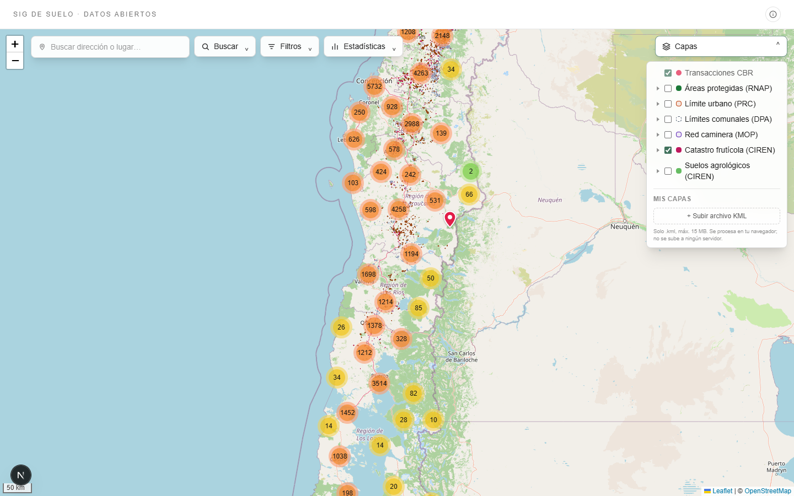

# sig.gabrielpantoja.cl — Land GIS

An interactive **open-data** map of rural land transactions recorded by Chilean
Real Estate Registries (*Conservadores de Bienes Raíces*, CBR) across
south-central Chile. It combines transaction records with official thematic
layers such as protected areas, urban boundaries, administrative boundaries,
the national road network, fruit-growing cadastres, and agricultural soils.

The project is designed as an ecoinformatics research tool and as a practical
reference for professionals working on court-ordered appraisals and
expropriations.



## Technology stack

- **Next.js 16** (App Router), **React 19**, and **TypeScript**
- **Tailwind CSS v4**
- **Leaflet** and **leaflet.markercluster** for imperative clustering of
  approximately 74,000 points
- **Neon** (`@neondatabase/serverless`) as the source of truth for CBR
  transactions, accessed through a SELECT-only `web_readonly` role
- **Vercel** deployment at `sig.gabrielpantoja.cl`

## Architecture

The browser never connects directly to PostgreSQL. All database access goes
through server-side route handlers that query an explicit allowlist of
privacy-safe columns:

```text
Browser → /api/{points,stats,export,facets,hexbins} → Neon (web_readonly, SELECT)
Browser → /api/geocode → Nominatim/OSM (Chile-only address search, cached proxy)
Browser → /api/suelos/{export,identify} → CIREN (fixed, validated proxy)
Browser → /api/vegetacional/{export,identify} → CONAF (fixed, validated proxy)
Browser → /api/propiedades-rurales/{export,identify,feature,search} → SII/CIREN (fixed, validated proxy)
```

Exports (`/api/export?format=csv|geojson`) are Excel-friendly CSV or GeoJSON
for QGIS. Filters are parameterised SQL (`src/lib/filters.ts`); full design
notes live in [`docs/`](./docs/).

## Data and privacy

Each point exposes `lat`, `lng`, `monto`, `anio`, `comuna`, `predio`,
`superficie`, `rol`, `destino`, `fechaEscritura`, `fechaInscripcion`, `fojas`,
`numero` and `conservador`.

- **`rol` is intentionally public**: it is the SII property identifier, not
  personal data under Chilean Law No. 19,628.
- **Never exposed:** `comprador`, `vendedor`, `rut`, `user_id`,
  `observaciones` — excluded at the query/handler level.
- Credentials stay server-side (`NEON_DATABASE_URL`); the client never
  connects to Neon.

## Data sources and licences

| Layer | Source | Licence / terms | Build or runtime path |
|---|---|---|---|
| CBR transactions | Project-maintained compilation of CBR registrations | Open data, anonymised in accordance with Chilean Law No. 19,628 | Neon Postgres through a read-only role |
| Protected areas (RNAP) | [Ministry of the Environment — National Registry of Protected Areas](https://lineasdebasepublicas.mma.gob.cl/datos_abiertos/dataset/areas-protegidas), *Public Baselines* portal | **CC0 1.0** (public domain) | `npm run data:build:protected` (mapshaper ETL) |
| Urban boundaries (PRC) | MINVU — municipal regulatory plans | Confirm terms with MINVU; referential use | `npm run data:build:urban` |
| Municipal boundaries (DPA) | SUBDERE — 2023 Political-Administrative Division (geoportal.cl) | Chilean government open data | `npm run data:build:comunas` |
| National road network | MOP — Directorate of Roads (mapasvialidad.mop.gob.cl) | Confirm terms with MOP; referential use | `npm run data:build:red-vial` |
| Electrical transmission lines | Ministry of Energy — IDE Energía; CEN geometry | Institutional public coverage; no standard licence declared; attribution required | `npm run data:build:lineas-transmision` |
| Drainage network (rivers and streams) | DGA — Banco Nacional de Aguas (ArcGIS FeatureServer) | Chilean government open data; DGA attribution, see `src/lib/red-drenaje.ts` | `npm run data:build:red-drenaje` |
| Fruit-growing cadastre | CIREN-ODEPA through IDE Minagri | CIREN-ODEPA attribution; see `src/lib/catastro-fruticola.ts` | `npm run data:build:catastro-fruticola` |
| Vegetation resources | CONAF through SIT CONAF and IDE Minagri | CONAF attribution; review the official source terms in `src/lib/vegetacional.ts` | Remote dynamic layer: viewport PNG plus point `identify` requests |
| Agricultural soils | CIREN public ArcGIS service (esri.ciren.cl) | CIREN attribution; see `src/lib/suelos.ts` | Remote dynamic layer through a validated proxy (one PNG per viewport) |
| Bioclimate (mean temperature, annual precipitation) | [WorldClim 2.1](https://www.worldclim.org/data/worldclim21.html), 1970–2000 climatology at 2.5 arc-minutes | **CC BY 4.0**; the Fick & Hijmans (2017) citation is part of the attribution, see `src/lib/bioclima.ts` | `npm run data:build:bioclima` (static PNG overlay) |

Static layers ship under `public/data/` (~45 MB) with a `*.meta.json`
provenance file and are rebuilt with `npm run data:build:<layer>`. Exact
attribution strings live in `src/lib/*.ts`.

> **Reading the layers correctly**
> - RNAP has 12 legal designations, each with its own legal framework — never a
>   single category.
> - Bioclimate is a 1970–2000 climatology interpolated from weather stations,
>   not a site measurement.
> - Transmission lines are referential centre-lines, not safety corridors,
>   easements or property encumbrances.

## Local development

```bash
cp .env.example .env.local   # set NEON_DATABASE_URL (web_readonly role)
npm install
npm run dev                  # http://localhost:3000
npm run lint && npm run typecheck   # before submitting a change
```

`NEON_DATABASE_URL` is server-side only: never prefix it with `NEXT_PUBLIC_`
and never commit `.env.local`.

## Roadmap and contributing

Planned layers and UX work are prioritised in
[`docs/roadmap.md`](./docs/roadmap.md). Contributions are welcome — read
[`CONTRIBUTING.md`](./CONTRIBUTING.md) and
[`CODE_OF_CONDUCT.md`](./CODE_OF_CONDUCT.md) first. Report security issues via
[`SECURITY.md`](./SECURITY.md), not a public issue.

## Licence

- **Source code:** [MIT](./LICENSE) © 2026 Gabriel Pantoja
- **Data layers:** each keeps its own licence (table above). WorldClim 2.1 is
  CC BY 4.0 and must be cited as Fick & Hijmans (2017), *Int. J. Climatol.*
  37(12): 4302–4315.
- **Basemaps:** © OpenStreetMap contributors, Esri World Imagery or
  OpenTopoMap, per `src/lib/basemap.ts`.
